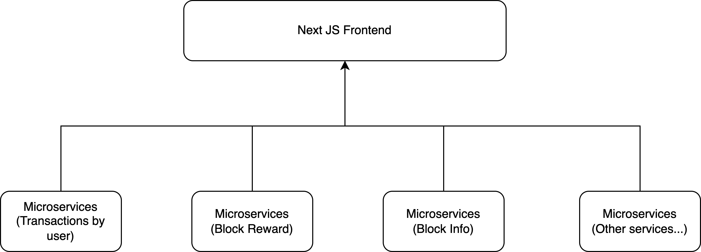

# Monorepo for ETDStats

This is the monorepo for ETDStats service. ETDStats service is a monitor service
for EtherData Blockchain. It contains multiple microservices and multiple frontend apps. 
The overall architecture 

